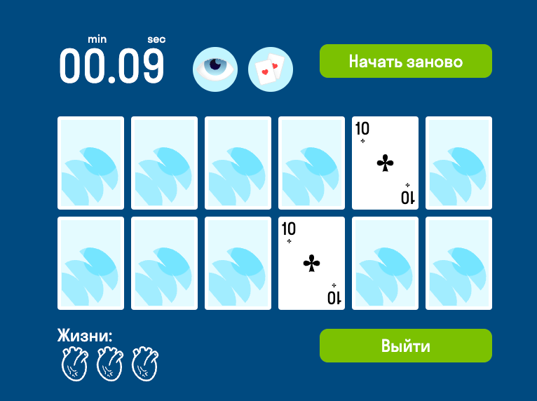

# MVP Карточная игра "Мемо"

В этом репозитории реализован MVP карточкой игры "Мемо" по [тех.заданию](./docs/mvp-spec.md)

## Разработка

Проект реализован на основе шаблона [Create React App](https://github.com/facebook/create-react-app).

Функционал
- суперсилы
- лидерборд
- режимы игры
- счетчик жизней
- уровни игры
- ачивки

### Деплой проекта: https://lkhusnullina.github.io/react-memo/



### Технологии:  
React, React Router, Redux, RTK Query, REST API, CSS modules

Настроены eslint и prettier. Корректность кода проверяется автоматически перед каждым коммитом с помощью lefthook (аналог husky). Закомитить код, который не проходит проверку eslint не получится.

#### Запуск проекта

#### Скачайте архив проекта или склонируйте репозиторий

```sh
git clone https://github.com/lkhusnullina/user-search.git
```

#### Установите зависимости проекта

```sh
npm install
```
#### Запустите проект командой

```sh
npm run start
```


